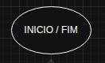
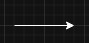
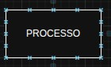
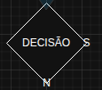
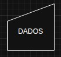
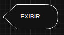
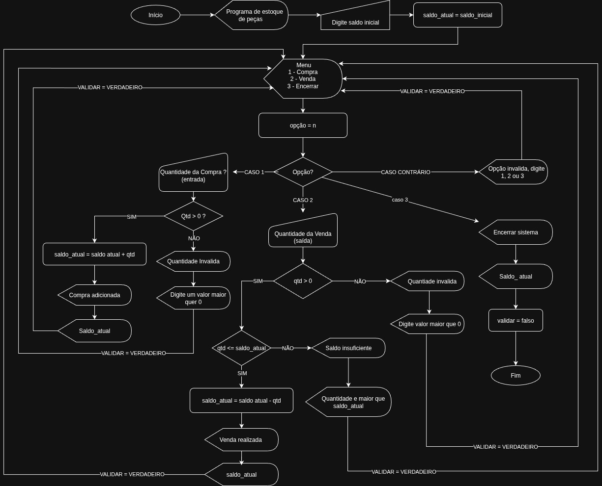

# UC06 · Lógica de Programação

## 📚 Introdução à Lógica de Programação

A lógica de programação é o fundamento essencial para o desenvolvimento de software, representando a capacidade de estruturar pensamentos e instruções de forma sequencial e coerente para resolver problemas computacionais.

---

## 🧮 Conceitos de Variáveis

As variáveis são elementos fundamentais para armazenamento de dados durante a execução de programas.

### Tipos de Variáveis:

| Tipo | JavaScript | Portugol | Descrição |
|------|------------|----------|-----------|
| Inteiro | `let x = 10;` | `inteiro x <- 10` | Números inteiros |
| Real | `let y = 3.14;` | `real y <- 3.14` | Números decimais |
| Caractere | `let letra = 'A';` | `caracter letra <- 'A'` | Caracteres únicos |
| Cadeia | `let nome = "João";` | `cadeia nome <- "João"` | Texto/strings |

---

## 🔀 Estruturas Condicionais

Permitem alterar o fluxo de execução com base em condições.

### Se/Senão (If/Else)

**JavaScript:**
```javascript
let idade = 18;

if (idade >= 18) {
    console.log("Maior de idade");
} else {
    console.log("Menor de idade");
}
```

**Portugol:**
```portugol
inteiro idade <- 18

se (idade >= 18) entao
    escreva("Maior de idade")
senao
    escreva("Menor de idade")
fimse
```

### Opção (Switch Case)

**JavaScript:**
```javascript
let dia = 2;
let nomeDia;

switch(dia) {
    case 1:
        nomeDia = "Domingo";
        break;
    case 2:
        nomeDia = "Segunda";
        break;
    default:
        nomeDia = "Dia inválido";
}
```

**Portugol:**
```portugol
inteiro dia <- 2
cadeia nomeDia

escolha (dia)
    caso 1: nomeDia <- "Domingo"
    caso 2: nomeDia <- "Segunda"
    caso contrario: nomeDia <- "Dia inválido"
fimescolha
```

---

## 🔁 Estruturas de Repetição (Looping)

Permitem executar blocos de código múltiplas vezes.

### Enquanto (While)

**JavaScript:**
```javascript
let contador = 1;

while (contador <= 5) {
    console.log("Número: " + contador);
    contador++;
}
```

**Portugol:**
```portugol
inteiro contador <- 1

enquanto (contador <= 5) faca
    escreva("Número: " + contador)
    contador <- contador + 1
fimenquanto
```

### Faça Enquanto (Do While)

**JavaScript:**
```javascript
let i = 1;

do {
    console.log("Valor: " + i);
    i++;
} while (i <= 5);
```

**Portugol:**
```portugol
inteiro i <- 1

faca
    escreva("Valor: " + i)
    i <- i + 1
enquanto (i <= 5)
```

### Para (For)

**JavaScript:**
```javascript
for (let i = 0; i < 5; i++) {
    console.log("Iteração: " + i);
}
```

**Portugol:**
```portugol
para (inteiro i <- 0; i < 5; i <- i + 1) faca
    escreva("Iteração: " + i)
fimpara
```

---

# 📞 Chamada de Métodos

## 🧠 Conceito de Métodos/Funções

Métodos (também chamados de funções, procedimentos ou sub-rotinas) são blocos de código que realizam uma tarefa específica e podem ser reutilizados em diferentes partes do programa. Eles promovem:

- **Modularização**: Dividir o programa em partes menores
- **Reutilização**: Evitar repetição de código
- **Organização**: Melhorar a legibilidade e manutenção
- **Abstração**: Esconder detalhes complexos de implementação

---

## 🔄 Métodos com Retorno

Métodos que processam dados e devolvem um resultado.

### 📋 Estrutura Básica:
```javascript
function nomeDoMetodo(parametro1, parametro2) {
    // Processamento
    return resultado; // Retorna um valor
}
```

### 💡 Exemplos Práticos:

**JavaScript:**
```javascript
// Método que calcula área do retângulo
function calcularArea(largura, altura) {
    return largura * altura;
}

// Método que verifica se número é primo
function ehPrimo(numero) {
    if (numero <= 1) return false;
    for (let i = 2; i <= Math.sqrt(numero); i++) {
        if (numero % i === 0) return false;
    }
    return true;
}

// Utilizando os métodos
let area = calcularArea(5, 8);
console.log("Área: " + area); // Área: 40

let numeroTeste = 17;
console.log(numeroTeste + " é primo? " + ehPrimo(numeroTeste)); // 17 é primo? true
```

**Portugol:**
```portugol
// Função que calcula potência
funcao real potencia(real base, inteiro expoente)
    real resultado <- 1
    para (inteiro i <- 1; i <= expoente; i <- i + 1) faca
        resultado <- resultado * base
    fimpara
    retorne resultado
fimfuncao

// Função que converte Celsius para Fahrenheit
funcao real celsiusParaFahrenheit(real celsius)
    retorne (celsius * 9/5) + 32
fimfuncao

// Utilizando as funções
real valorPotencia <- potencia(2, 3) // 8.0
real temperaturaF <- celsiusParaFahrenheit(25) // 77.0

escreva("2 elevado a 3 é: ", valorPotencia)
escreva("25°C em Fahrenheit é: ", temperaturaF)
```

---

## ⚡ Métodos sem Retorno (Void)

Métodos que executam ações mas não retornam valores.

### 📋 Estrutura Básica:
```javascript
function nomeDoMetodo(parametro1, parametro2) {
    // Executa ações
    // Não possui return com valor
}
```

### 💡 Exemplos Práticos:

**JavaScript:**
```javascript
// Método que exibe menu de opções
function exibirMenu() {
    console.log("=== MENU PRINCIPAL ===");
    console.log("1. Cadastrar usuário");
    console.log("2. Listar usuários");
    console.log("3. Sair");
    console.log("======================");
}

// Método que processa pedido
function processarPedido(cliente, produtos) {
    console.log("Processando pedido para: " + cliente);
    console.log("Itens do pedido:");
    
    produtos.forEach(produto => {
        console.log("- " + produto);
    });
    
    console.log("Pedido enviado para preparo!");
}

// Utilizando os métodos
exibirMenu();
processarPedido("João Silva", ["Pizza", "Refrigerante", "Sobremesa"]);
```

**Portugol:**
```portugol
// Procedimento que desenha retângulo
funcao desenharRetangulo(inteiro largura, inteiro altura, caracter caractere)
    para (inteiro i <- 1; i <= altura; i <- i + 1) faca
        para (inteiro j <- 1; j <= largura; j <- j + 1) faca
            escreva(caractere)
        fimpara
        escreva("\n") // Nova linha
    fimpara
fimfuncao

// Procedimento que exibe dados do usuário
funcao exibirDadosUsuario(cadeia nome, inteiro idade, cadeia email)
    escreva("=== DADOS DO USUÁRIO ===")
    escreva("Nome: ", nome)
    escreva("Idade: ", idade)
    escreva("E-mail: ", email)
    escreva("=========================")
fimfuncao

// Utilizando os procedimentos
desenharRetangulo(5, 3, '*')
exibirDadosUsuario("Maria Oliveira", 30, "maria@email.com")
```

---

## 🎯 Tipos de Retorno Comuns

| Tipo de Retorno | JavaScript | Portugol | Exemplo de Uso |
|-----------------|------------|----------|----------------|
| Numérico | `number` | `inteiro`, `real` | Cálculos matemáticos |
| Texto | `string` | `cadeia` | Formatação de texto |
| Booleano | `boolean` | `logico` | Verificações condicionais |
| Array/Lista | `array` | `vetor`, `matriz` | Processamento de coleções |
| Nenhum | `void` | (omitido) | Ações sem retorno |

---

## 🚀 Boas Práticas com Métodos

1. **Nomes significativos**: Use verbos que descrevam a ação
2. **Responsabilidade única**: Cada método deve fazer uma coisa específica
3. **Parâmetros claros**: Use nomes descritivos para os parâmetros
4. **Documentação**: Comente o propósito e uso do método
5. **Tamanho adequado**: Métodos muito longos devem ser divididos

**Exemplo de método bem estruturado:**
```javascript
/**
 * Calcula o preço final com desconto
 * @param {number} precoOriginal - Preço original do produto
 * @param {number} percentualDesconto - Percentual de desconto (0-100)
 * @returns {number} Preço final com desconto aplicado
 */
function calcularPrecoComDesconto(precoOriginal, percentualDesconto) {
    if (percentualDesconto < 0 || percentualDesconto > 100) {
        throw new Error("Percentual de desconto inválido");
    }
    
    const desconto = precoOriginal * (percentualDesconto / 100);
    return precoOriginal - desconto;
}
```

Esta abordagem torna o código mais legível, mantenável e menos propenso a erros, seguindo os princípios de modularização e reutilização que são fundamentais na programação.

## 🧩 Introdução à Programação Orientada a Objetos (POO)

### Classes

**JavaScript:**
```javascript
class Pessoa {
    constructor(nome, idade) {
        this.nome = nome;
        this.idade = idade;
    }
    
    apresentar() {
        return `Meu nome é ${this.nome} e tenho ${this.idade} anos.`;
    }
}
```

**Portugol:**
```portugol
classe Pessoa
    cadeia nome
    inteiro idade
    
    funcao inicializar(cadeia n, inteiro i)
        nome <- n
        idade <- i
    fimfuncao
    
    funcao cadeia apresentar()
        retorne "Meu nome é " + nome + " e tenho " + idade + " anos."
    fimfuncao
fimclasse
```

### Objetos

**JavaScript:**
```javascript
let pessoa1 = new Pessoa("Carlos", 25);
console.log(pessoa1.apresentar());
```

**Portugol:**
```portugol
Pessoa pessoa1 <- novo Pessoa()
pessoa1.inicializar("Carlos", 25)
escreva(pessoa1.apresentar())
```

---

## 📊 Fluxograma

Um fluxograma é uma representação visual de um algoritmo ou processo, utilizando símbolos padronizados para ilustrar o fluxo de execução.

### Símbolos Principais:

| Símbolo | Nome | Descrição |
|---------|------|-----------|
|  | **Início/Fim** | Define onde o fluxo de trabalho começa e termina |
| | **Fluxo** | Conector direcionado de um nó para outro |
|  | **Processo** | Representa uma ação ou operação |
|  | **Decisão** | Cria ramificações baseadas em condições |
|  | **Dados** | Entrada ou saída de dados |
|  | **Exibir** | Mostra informação ao usuário |

### Exemplo de Fluxograma:


Este fluxograma representa um algoritmo que:
1. Inicia o processo
2. Lê um número
3. Verifica se é par
4. Exibe "Número par" se verdadeiro ou "Número ímpar" se falso
5. Finaliza o processo

Os fluxogramas são ferramentas visuais essenciais para planejar a lógica de programas antes da implementação do código.

## 💡 Exercicio Proposto - Estoque

A empresa **Savinis**, especializada em software de alta performance, solicitou o desenvolvimento de um sistema para controle de estoque de peças. O objetivo é substituir o controle manual por uma solução digital simples, eficiente e de fácil uso para os funcionários.


## 📋 Requisitos

- Controle de estoque para **apenas uma peça**.
- Solicitar o **saldo inicial** da peça ao iniciar o sistema.
- Permitir dois tipos de operação:
  - **Compra (entrada)** de peças.
  - **Venda (saída)** de peças.
- Continuar solicitando operações até o usuário optar por encerrar.
- Validar operações:
  - Compra: soma a quantidade ao estoque.
  - Venda: subtrai a quantidade do estoque, se houver saldo suficiente; caso contrário, exibe mensagem de "Saldo insuficiente".
- Exibir o saldo atualizado após cada operação.
- Ao encerrar, mostrar a mensagem "Sistema encerrado".

## ▶️ Como Executar

1. Abra o arquivo [index.html](index.html) em um navegador.
2. Clique no botão **INICIAR ESTOQUE** para iniciar o sistema.
3. Siga as instruções exibidas nas caixas de diálogo.

## 🔎 Passos Lógicos

1. Aperte o botão **INICIAR ESTOQUE**
2. Solicitar o saldo inicial da peça.
3. Exibir menu de operações: Compra, Venda ou Encerrar.
4. Para cada operação:
   - Se Compra: solicitar quantidade e somar ao saldo.
   - Se Venda: solicitar quantidade e subtrair do saldo, se possível.
   - Validar entradas e exibir mensagens apropriadas.
   - Exibir saldo atualizado.
5. Repetir até o usuário escolher encerrar.
6. Exibir mensagem de encerramento.


## 🛠️ Solução

- 📊 **Fluxograma:**  
  

- 📄 **Código em Portugol:**  
  O algoritmo foi desenvolvido utilizando o site [portugol.dev](https://portugol.dev/).  
  Veja o código em: [portugol/estoque.por](portugol/estoque.por)

- 💻 **Código em JavaScript:**  
  Veja a implementação em [js/estoque.js](js/estoque.js).

- 🌐 **Interface HTML:**  
  O sistema pode ser iniciado pelo arquivo [index.html](index.html).


## 🧙‍♂️ Desenvolvedor

**Darlei Mota**  
📍 Aprendiz de Código em Jornada/Senai - Full Stack

🔗 [Github](https://github.com/DarleiMota)  
🔗 [LinkedIn](https://www.linkedin.com/in/darleimota)